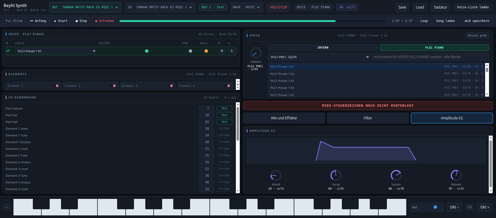
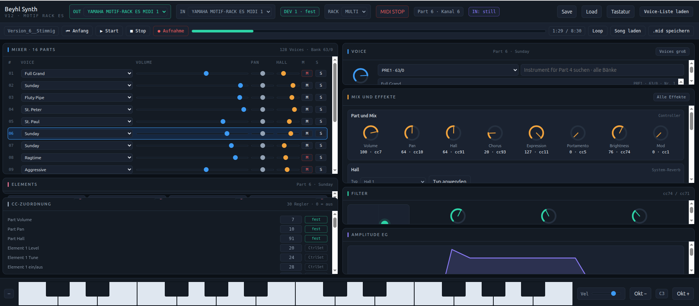

# Motif Synthesizer Control

Free control software for the Yamaha Motif Rack ES, running directly in the browser via the Web MIDI interface.

## Version 17 — with PLG1 Extension

## Start

Open the current test version [`beyhl_synth_V17.html`](beyhl_synth_V17.html) in Chrome and allow MIDI access, then connect the Motif Rack ES via USB.

Version 17 uses the Yamaha-documented Multi Part parameter-change addresses to control the 16 internal parts. It adds the installed PLG1 piano board as a separate Part 00 with its own MIDI channel, voice, volume, pan, reverb, mute, and solo controls. PLG1 starts muted in Multi mode so that it cannot play unnoticed alongside an internal part.

In Voice mode, **INTERN** and **PLG1 PIANO** can be selected directly. Both sources remember their own bank, voice, volume, pan, and reverb settings independently from Multi mode. Instrument search follows the selected sound source. Complete setups can be saved under freely chosen names and loaded again through the browser's file dialogs, starting in the Music folder.

## Interface History

All three project screenshots are retained here:

## Notice

The voice names used in this program originate from the Yamaha Motif Rack ES and serve only as designations for the sounds. All rights to these names belong to Yamaha Corporation. The sounds can easily be adapted to other Yamaha synthesizers, not just the ES. This project is intended as an open source contribution to support the wonderful Yamaha synthesizers and make their great hardware even more usable.

## Open Source and Usage Terms

This program is made available as open source for non-commercial use.

- You may use, study, modify, and redistribute the program for non-commercial purposes.
- Any modified or redistributed version must clearly credit **Klaus Beyhl** as the original author and retain this notice.
- Commercial use, sale, paid distribution, or integration into a commercial product or service is not permitted without prior written permission from Klaus Beyhl.

## AI Integration and Extensibility

The program is deliberately designed so that it can be extended easily. Its browser-based structure and Web MIDI controls provide a practical foundation for adding an AI connection in the future. For example, an AI assistant could translate natural-language instructions into synthesizer parameter changes, manage sounds, automate control sequences, or provide context-aware help while operating the instrument. No AI service is included by default, so developers remain free to connect the model or local AI system of their choice.
